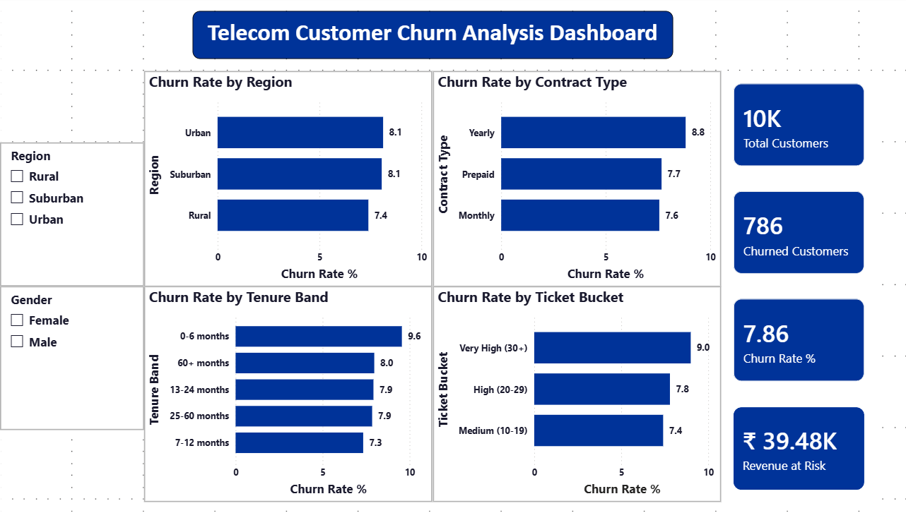

# Telecom Customer Churn Analysis

## Project Overview

This project analyzes customer churn for a telecom company using a dataset of 10,000 customers across 12 months (2023). The goal is to identify **why customers leave, which segments are most at risk, and what actions the business can take to reduce, churn and protect revenue.**

This is an end-to-end business analysis project covering data quality audit, SQL-based segmentation analysis, and an interactive Power BI dashboard - built to simulate a real-world DA/BA workflow.

---

## Business Problem

Customer churn is one of the most expensive problems in telecom. Acquiring a new customer costs up to 5x more than retaining an existing one. This analysis answers three core questions:

1. What is our current churn rate and what is the revenue impact?

2. Which customer segment are churning the most?

3. Who are the high-risk customers we should target for retention?

---

## Tools & Technologies

|Tool|Purpose|
|-|-|
|Python (Pandas)|Data cleaning \& quality audit|
|MySQL|Business analysis \& segmentation queries|
|Power BI|Interactive dashboard|

## Dataset

* **Source:** [Kaggle - Telecom Customer Churn & Data Quality Challenge](https://www.kaggle.com/competitions/telecom-customer-churn-data-quality-challenge)
* **Size:** 10,000 customers, 120,000 rows (12 months of usage of data per customer)
* **Files:** 'customer_info.csv', 'usage_data.csv', 'churn_labels.csv'

---

## Data Quality Issues Found & Fixed 

During the audit phase, 4 categories of data issues were identified and resolved:

|Issues|Details|Fix Applied|
|-|-|-|
|Duplicate rows|200 duplicate CustomerIDs (195 identical, 5 conflicting)|Dropped identical duplicates; kept earliest SignupDate for conflicts|
|Missing values|35.1% of Age values were null (3,583 customers)|Imputed with median age per Contract Type group|
|Negative charges|5 customers had negative MonthlyCharges|Applied absolute value correction|
|Wrong data type |Month column stored as year only after MySQL import|Recalculated using TIMESTAMPDIFF from SignupDate|

---

# Key Figures

### 1. Overall Churn Rate

* **786 out of 10,000 customers churned - a 7.86% churn rate**
* Monthly revenue lost to churn: **₹39,478 (~7.74% of total revenue)**
* Annualized revenue at risk: **~₹473,736**

### 2. Contract Type is the Biggest Churn Driver 

|Contract Type |Churn Rate |
|-|-|
|Yearly |8.82% (highest)|
|Prepaid|7.67% |
|Monthly|7.56%|

> **Insight:** Yearly contract customers churn the most - counterintuitive but suggests a contract renewal problem. Customers complete their annual term and do not renew, likely switching to competitors at the natural exit point.

### 3. New Customers are the Most Vulnerable

|Tenure Band |Churn Rate|
|-|-|
|0-6 months |9.56% (highest)|
|60+ months|8.00%|
|13-24 months|7.90%|
|25-60 months|7.90%|
|7-12 months|7.30%|

> **Insight:** Customers in their first 6 months churn at the highest rate, pointing to an onboarding experience gap. Customers who survive past 7 months are the most loyal segment.

### 4. Support Ticket Volume Correlates with Churn

|Avg Monthly Tickets|Churn Rate |
|-|-|
|Very High (30+)|9.00%|
|High (20-29)|7.80%|
|Medium (10-19)|7.40%|

> **Insight:** Customers raising frequent support issues are 21% more likely to churn than low-interaction customers. High support contract is an early warning signal for churn.

### 5. Geography is NOT a Churn Driver

Churn rates are uniform across Urban (8.10%), Suburban (8.10%), Rural (7.40%) segments - ruling out geography and network quality as root causes.

### 6. Highest Risk Segments (Combined Analysis)

|Contract Type|Tenure Band |Churn Rate|Revenue at Risk|
|-|-|-|-|
|Yearly |25-60 months|9.13%|₹5,165/month|
|Yearly|13-24 months|9.09%|₹1,593/month|
|Prepaid|25-60 months|7.62%|₹8,397/month|

---

## Business Recommendations

**1. Introduce a Contract Renewal Incentive Program**

Target Yearly contract customers at the 10-11 month mark (before renewal) with loyalty discounts or service upgrades. This directly addresses the highest churn segment (8.82%).

**2. Strengthen the Onboarding Experience**

Customers in their first 6 months churn at 9.56%. A structured 90-day onboarding program - welcome calls, usage tips, proactive check-ins - could meaningfully reduce early churn.

**3. Proactive Support Intervention**

Flag customers averaging 30+ monthly support tickets for proactive outreach before they churn. Resolving issues before frustration peaks is significantly cheaper than acquisition.

**4. Prioritize Retention Budget on Prepaid 25-60 Month Segment**

Despite a moderate churn rate (7.62%), this segment represents the largest revenue at risk (₹8,397/month) due to its size (2,218 customers). Even a 1% churn reduction saves ~₹1,100/month.

---

## Data Limitations

* The dataset contains a binary churn flag without an exact churn date, preventing month-level trend analysis. A production dataset would include churn timestamps for time-series analysis.
* Tenure was approximated using SignupDate and a fixed reference date (Dec 31, 2023) rather than an actual contract end date.

## Dashboard Preview

